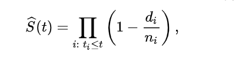
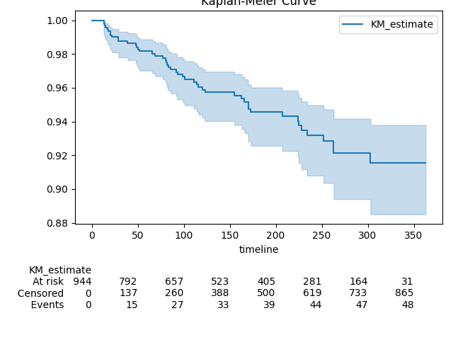

In the fast paced world of business, decision makers are usually interested in interpreting customer behavior in order to understand them better. With a better understanding, the business can then deploy marketing or operational actions that either prevent the customer from leaving (**churn**) or keeping the customer happy such that they are more likely to stay(**retention**)

In either case, the business needs to find the optimal point at which the customer is most likely to leave and then, make their move. If they make their move too early, they waste resources and if they are too late, they lose the customer. Is there a scientific/repeatable way to know this **“golden point”**  in time? The time it takes for the event to happen with a certain probability? Apparently, researchers in the field of medicine have had a go at this and came up with an estimator. This value is generally used to interpret survival of a subject from a certain **“event”**. 

Generally, this estimator falls into the broad category of _survival curves_(due to the general shape of the result on a line graph) ; the method is referred to as the Kaplan Meier estimator. Read more about it [here](https://www.karger.com/Article/Fulltext/324758)

In this tutorial, we will consider a scenario of an IoT company that sells a remote sensing device.The sample data can be found in this [repository](https://github.com/KimaruThagna/CohortAnalysis/tree/master) along with the code used to generate the sample data. The device usually sends regular updates on a daily basis and the update is one of two types. **ROUTINE CHECK** and **SYSTEM ERROR**. 

As a business, we will be interested in the error message as our event and the time between the date of purchase and the date of occurrence of the event as the time to event in days. The graph will be interpreted as **“what is the probability of survival by the population(user devices) from the event of a system error at day X”**

In performing survival analysis, the first concept that needs to be made available is the time to event. The time in whatever frame(days, weeks, minutes, years) from beginning of observation to when the event occurs. In our case, the beginning of the observation is the date of sale of the device. The end is when the first error event is sent per user. 

In the csv linked [here](https://github.com/KimaruThagna/CohortAnalysis/tree/master/data), this computation has already been done and the **time_to_event** value has been computed in the **days_to_event** column. With most datasets, you will be able to have a **duration_to_event** column or derive it easily. However if the use case is similar to ours where we have two different datasets, consider this step in SQL. Can also be easily translated to Python. Follow [this link](https://github.com/KimaruThagna/CohortAnalysis/blob/master/sql/duration_table.sql) for the SQL version.


```sql
UserId,RegistrationDate,EventType,EventDate,days_to_event
85,2021-03-19,SYSTEM ERROR,2021-08-29,163
25,2021-05-10,SYSTEM ERROR,2021-05-23,13
15,2021-06-12,SYSTEM ERROR,2021-07-31,49
```

After you have your time to event data, you now get to apply the Kaplan meier estimator to the data. This will generate a different dataset that is commonly known as the **survival table**. 

The survival table is what is plotted and gives the survival curves that many know of. To apply the estimator, one needs a bit of an understanding of the math behind it.

[Image credits](https://en.wikipedia.org/wiki/Kaplan%E2%80%93Meier_estimator)


T is the total observation time. <sub>i</sub> is a point in time between 0 and the maximum t. For example, if you are looking at events over 1 year, your t value would be 365. At time t<sub>i</sub>, d<sub>i</sub> is the number of events that have happened as at time t<sub>i</sub>. In our case, this will be the number of users whose devices have reported their first error message. N<sub>i</sub> is the number of subjects that have either survived the event or are still at risk of experiencing the event as at at time t<sub>i</sub>. In our scenario, this is the number of users whose devices have survived failure or are still at risk of failing as at time t<sub>i</sub>.

We then subtract this ratio from 1 to get the ratio of survivors because the end goal is to determine who survived at a specific point in time.

The PI symbol is a cumulative product symbol. This gives the cumulative survival probability of all the user devices at time t.

All the above will be quite tricky to compute by hand. It would require deep knowledge of statistics which may not be the case to many. This is why there is the library lifelines which makes all this easier. All the above is reduced to 3-7 lines of code.

To use the library, only two items are required. The **time_to_event** column and the **target/event** column. Since the target column varies from one use case to the other, a simple transformation step is required. Transform the column values to boolean where the target event is `TRUE(1) `and the rest are `FALSE(0)`

``` python
import pandas as pd
import matplotlib.pyplot as plt
from lifelines import KaplanMeierFitter 

df = pd.read_csv('data/duration.csv')
df['EventType'] = [1 if x == 'SYSTEM ERROR' else 0 for x in df['EventType']]
time_to_event = df['days_to_event']
event = df['EventType']

kmf = KaplanMeierFitter()
kmf.fit(time_to_event, event_observed=event)
kmf.plot(at_risk_counts=True)
plt.title('Kaplan-Meier Curve')
plt.show()


```
In the code above, we are defining a new column Target and assigning to it the result of the transformation. Once done, all that is required is to fit and plot the **Kaplan Meier** estimate. 



In the example above, we can interpret the following
- At day 50, there is a 0.99 probability of devices surviving the SYSTEM ERROR EVENT
- The least probability of survival being 0.88 means the business can promise the devices will survive the SYSTEM ERROR event at day 350(roughly 1 year) with 88% confidence.
- At day 50, there is a 0.01 probability that devices do not survive the event and hence, report an error. 

In conclusion, we have learnt about the Kaplan Meier estimator and how to employ it to answer vital business questions around survival of events. With such knowledge, so much more is possible. Some other applications of this technique include determining:

1. How many days until a customer cancels our subscription
2. How many hours until our IoT device fails
3. How many orders do customers make until they cancel their subscription
4. How many years until our installed water pump fails


Knowing about all the above with a good degree of accuracy allows a business to not only operate efficiently but to also stay ahead of competition by handling their customers or assets better. All using the power of data.

